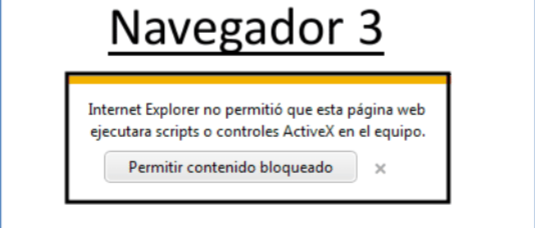

#### *Diego Gutiérrez Vázquez*

###  ***Proyecto 1: Explorando los Fundamentos del Desarrollo Web en Entornos de Cliente***

#### Parte 1 - Modelos de Programación en Entornos Cliente/Servidor:

Referencia principal :https://kinsta.com/es/blog/arquitectura-aplicaciones-web/#:~:text=En%20palabras%20sencillas%2C%20la%20arquitectura,el%20cliente%20y%20el%20servidor.

*-Arquitectura de una sola página(SPA) *
Se caracteriza por que todo se basa en una página como su nombre indica, esto lo que nos quiere decir es que el usuario no tiene la necesidad de navegar fuera de esta gracias a su automatización, fluidez y que es capaz de cubrir las necesidades del usuario.

Algunos ejemplos pueden ser GitHub,Gmail o GoogleMaps (https://appmaster.io/es/blog/que-son-las-aplicaciones-de-una-sola-pagina)

*-Arquitectura de aplicaciones web progresivas(PWA)*
Parecidas a la arquitectura de una sola página,pero esta es capaz de proporcionar capacidades offline y se pueden instalar en los dispositivos de los usuarios. Al estar basadas en la arquitectura de una sola página estas también tienen sus características.
Un ejemplo puede ser Twitte,Flipkart,Trivago o AliEXpress
(https://www.cisin.com/coffee-break/es/technology/top-progressive-web-app-examples-that-enterprises-can-learn.html)

*-Arquitectura de renderizado del lado del servidor(SSR)*
Son aquellas en las que el renderizado se realiza en el servidor tras previamente haber sido solicitado por un usuario.Esto ayuda a quitarle carga a la parte del cliente, ya que este recibe una página web estática.Suelen ser utilizadas en blogs y en sitios de comercio electrónico.

*-Arquitectura de generación de sitios estáticos*
La página web se genera previamente para posteriormente almacenarse en el servidor como archivo Html,CSS y JS.Cuando el usuario desea una página se la muestra instantáneamente teniendo tiempos de carga reducidos,pero esto también hace que aumente la elaboración de la aplicación.Este tipo de arquitectura se suele usar en blogs,documentación o portafolios lo mismo que SSR.
Tiene una gran desventaja y es que no se puede crear aplicaciones dinámicas.

#### Parte 2 - Mecanismos de Ejecución de Código en un Navegador Web. Capacidades y Limitaciones de Ejecución.

*-Compatibilidad con Navegadores Web*

Referencia:
 https://www.edgardandrea.com/como-se-ejecuta-javascript-dentro-de-un-pagina-web/

https://learn.microsoft.com/es-es/microsoft-edge/devtools-guide-chromium/console/console-javascript

Para poder ejecutar código en Navegadores web, debemos seguir una serie de pasos:
Debemos presionar el clic derecho y entrar en inspeccionar, una vez allí debemos 
abrir la consola de DevTools. 

Al ser JavaScript un lenguaje interpretado, este se ejecuta al instante en los navegadores ya que el intérprete viene dentro de estos. Es el intérprete el que se encarga de convertir el código JavaScript. El contenido de JavaScript, puede aparecer en cualquier parte de un documento HTML,puede haber varios bloques de código de JavaScript, los cuales se ejecutarán según el orden en el que estén situados físicamente o con la interacción de un usuario, no obstante , aquella parte del código que se encuentre en funciones o gestores de eventos no se ejecutará sin previo llamamiento de las mismas.

*Evaluación de las diferencias de compatibilidad entre navegadores*

Referencia: 
https://docplayer.es/89386088-Diferencias-entre-navegadores-en-respuestas-a-javascript-firefox-explorer-chrome-safari-javascript-en-linea-cu01108e.html

https://www.edgardandrea.com/javascript-es-igualmente-compatible-en-todos-los-navegadores/

Hoy en día la compatibilidad entre los distintos tipos de navegadores es bastante alta respecto a la de hace unos años en cuanto a JavaScript, esto no quita que pueda haber alguna, ya que, cada navegador tiene una forma de interpretarlo.

Aquí tenemos algunos ejemplos de cómo se comporta JavaScript en diferentes navegadores.

 
 
 
 

*Navegador 1* .Podemos ver una ventana que nos muestra información , no tiene marco ni cruz para su cierre ni título

*Navegador 2* .Observamos que a diferencia del anterior este posee todo lo que el otro no tenía.

*Navegador 3* .En este caso ,no ejecuta la acción,por ello el navegador nos informa que no ha sido posible ejecutar el script.

*Navegador 4* .Por último este navegador, no hace nada, ni  ejecuta el script ni tampoco nos avisa de que no pudo ser ejecutado.

Tras ver estos ejemplos podemos decir que:

- Cada navegador tiene su propia interfaz o apariencia para distintos elementos, como el navegador 1 y 2.
- Algunos navegadores no ejecutan el script como pueden ser el ejemplo 3 y 4, ya sea porque no lo tienen activo o la compatibilidad es nula.


*Resolución de problemas de compatibilidad en una aplicación web*

Los problemas que podemos llegar a encontrar sobretodo es que no se ejecuten las acciones, para ello algunas de las medidas que podemos tomar para la resolución de estas son las siguientes:

- La configuración de seguridad de los navegadores puede ser uno de los motivos por los cuales la ejecución de un script no se lleve a cabo.


- También puede influir el sistema operativo o el tipo de dispositivo que estemos utilizando. Para esto último la solución ya no quedaría en nuestra mano.


#### Parte 3 - Lenguajes de Programación en Entorno Cliente.

*JavaScript*
Referencia:https://developer.mozilla.org/es/docs/Learn/JavaScript/First_steps/What_is_JavaScript
https://www.freecodecamp.org/espanol/news/ventajas-y-desventajas-de-javascript/

Lenguaje de programación con secuencias de comandos que nos permite la creación de contenido dinámico.
Podemos destacar su velocidad ya que normalmente se ejecuta al instante en los navegadores, es simple , ya que está basado en java y no es muy complicado de aprender en comparación con otros lenguajes, es compatible con la mayoría de páginas web y recibe actualizaciones y soporte anuales.
Hoy en día es uno de los más usados y extendidos por la comunidad.


*TypeScript*
Referencia:https://profile.es/blog/que-es-typescript-vs-javascript/
Al igual que JavaScript es un lenguaje de programación con secuencias de comandos que nos permite la creación de contenido dinámico, con mayor características que JavaScript siendo estas algunas como  su sencillez a la hora de hacer código,lo cual nos hace cometer  menos errores de código y a su vez que tenga más coherencia y por último destacar la facilidad a la hora de probarlo.

Este lenguaje está más pensado para proyectos largos o medianos y el uso de frameworks.Siendo así un lenguaje más maduro que JavaScript.
Aunque sí es cierto que para proyectos de menor extensión Typescript se nos queda demasiado grande siendo mejor opción JavaScript.


*VbScript* 
Referencia:https://programacionwebisc.wordpress.com/2-2-lenguajes-de-programacion-del-lado-del-cliente/
https://desarrolloweb.com/home/vbscript


Lenguaje de programación que viene integrado con Internet Explorer.
Fue creado por Microsoft y la función era la misma que la de JavaScript aunque este tenía varias limitaciones el cual su competidor(JavaScript) aprovechó para ganarle ventaja.También lo condiciono el uso exclusivo que tenía en tan solo un navegador haciendo esto que se dejara de usar.


*Applet Java*
Referencia:https://es.wikipedia.org/wiki/Applet_Java
https://www.quora.com/Was-it-JavaScript-that-killed-Java-applet

Este sirve para lo mismo que los anteriores mencionados, un programa capaz de incrustarse en un documento HTML.Tiene la peculiaridad de que este se descarga en el navegador para luego ejecutarse,esto nos permite poder crear programas que los usuarios puedan entrar con tan solo cargar la página web en su navegador.

Tiene características como su compatibilidad con la mayoría de navegadores, aunque esto se ve afectado porque requiere plugins que no todos los navegadores
soportan,es multiplataforma ,es capaz de trabajar con las distintas versiones de Java y se guarda en memoria caché de los navegadores para ser más rápidos en futuras entradas a las páginas.Lo malo de todo esto es que su seguridad no es muy buena y tiene competidores como JavaScript, TypeScript …

En conclusión de los varios ejemplos que hemos visto, los más recomendados son JavaScript para proyectos más simples y TypeScript para proyectos largos.Aunque hay muchos más y estos suelen de los más populares del mercado, cada uno es libre de crear con el que más guste ya que la mayoría son válidos para la creación de contenido en el entorno cliente.


#### Parte 4 - Características de los Lenguajes de Script. Ventajas y Desventajas:

https://www.hostgator.mx/blog/scripting/
https://es.quora.com/Cu%C3%A1l-es-la-diferencia-entre-un-lenguaje-de-programaci%C3%B3n-y-un-lenguaje-de-scripting

Una de las principales ventajas del lenguaje de script, es que estos se ejecutan directamente en el navegador mientras que los lenguajes de programación necesitan una compilación previa antes de la ejecución, en conclusión los script son más rápidos, también suelen ser más simples los lenguajes de script que lo de programación aunque estos últimos son más completos dado a su mayor complejidad. Sin embargo el lenguaje de script es sin tipado fuerte o tipado dinámico, es decir son menos seguros que los lenguajes de programación y suelen depender internamente de otro lenguaje.

En conclusión ambos son lenguajes con fines distintos y creados para desempeñar funciones concretas como puede ser JavaScript que se utiliza para darle vida a nuestras páginas web o C++ que se suele usar para crear videojuegos

---

#### Parte 5 - Tecnologías y Lenguajes Asociados. Integración del Código con las Etiquetas HTML:

*Exploración de tecnologías como CSS y HTML5.*

- HTML5
Referencia:
https://es.wikipedia.org/wiki/HTML5
https://es.wikipedia.org/wiki/HTML

HTML5 es la 5ª versión de HTML, este es un lenguaje de marcado utilizado para crear páginas web.Nos permite crear la estructura y el contenido que vamos a mostrar en nuestra página web. Se considera el lenguaje web más importante siendo importante para el desarrollo y la expansión del WWW (World Wide Web) que utilizan todos los navegadores actuales. Este lenguaje se basa en las etiquetas las cuales realizarán una acción dependiendo de su función en el documento.
Aquí un ejemplo de etiqueta: 
```html
<p> hola </p>
```
Retomando el HTML5, este incluye varias mejoras respecto a sus versiones anteriores como la eliminación de etiquetas que ya no se utilizan y mejoras varias para el mejor el rendimiento y la nomenclatura.

Ejemplos de uso HTML:
```html
<!DOCTYPE html> 
<html lang="es"> 
	<head>
		<meta charset="UTF-8">
		<title>Ejemplo de HTML</title> 
	</head> 
	<body> 
		<h1>Título</h1> 
		<h2>Título 2</h2>
		<p>Párrafo de ejemplo</p>
		<ul>
			<li>Lista 1</li> 
			<li>Lista 2</li> 
			<li>Lista 3</li> 
		</ul>
	</body>
</html>
```
- CSS
Referencia:
https://es.wikipedia.org/wiki/CSS

Un lenguaje de diseño que se aplica sobre HTML o XHTML,SVG,XUL,RSS…
Es usada en muchos sitios web para crear contenido visualmente atractivo.
CSS no permite cambiar fondos, colores de fuentes, tipos de fuentes,siendo unas de sus principales funciones la de marcar la separación del contenido de un documento. También nos sirve para evitar la repetición de código y ayudarnos a reducir la complejidad a la hora de usar varios archivos HTML.
Su sintaxis es bastante simple, teniendo palabras reservadas en inglés(como otros lenguajes de programación,HTML…) que se usan para definir las propiedades que adoptaran las etiquetas.
Aquí dos ejemplo básicos de CSS:
~~~~
1º

p { 
color: red;
 font-size: 20px;
 }


2º

p { 
background-color: red; 
margin-top: 20px; 
padding: 15px; 
border: 10px;
 }
~~~~~


*Creación de una pequeña aplicación web integrando código JavaScript de diferentes maneras.*

```html
<!DOCTYPE html> 
<html lang="es"> 
<head>
<meta charset="UTF-8">
 <title>Parte 5</title>
<script>
	function funcionJS(){
		alert('Buen trabajo');	
}
 </script>
</head>
<body> 
<h1>Parte 5</h1>
<button onclick  = "funcionJS()"> Click aquí </button> 
</body> 
</html>

```


 #### Parte 6 - Herramientas de Programación:

*Uso de herramientas como Visual Studio Code, Chrome DevTools, etc.*

- Visual Studio Code
Referencia:
https://solucionescdi.com/conoce-las-ventajas-y-desventajas-de-descargar-visual-studio-code/

Visual Studio Code es un editor de código muy usado por los programadores, en él podemos ver una gran amplia gama de plugins que nos permite trabajar con cualquier lenguaje.

Entre sus ventajas podemos destacar:
Es gratuito,es bastante moderno en comparación de sus competidores, es capaz de reconocer cualquier lenguaje con las extensiones adecuadas y nos recomienda la utilizacióno mejoras en nuestro código.

En conclusión es una herramienta que nos ayuda bastante a la hora de crear contenido que posee una gran versatilidad y personalización proporcionandonos libertad total. 
 

- Github
Referencia: https://es.quora.com/Qu%C3%A9-ventajas-y-desventajas-tiene-Git-en-el-control-de-versiones

Github es una herramienta que nos permite la subida de códigos y tenerlos en privado o público según deseamos,Esta herramienta no solo nos permite esto si no que nos brinda las oportunidades de trabajar desconectado, con personas en un mismo proyecto y se pueden realizar control de versiones gracias a sus comandos de subida,guardado,ramas,borrado…

Las ventajas que podemos destacar de Github son las siguientes:
Es gratis,no es muy compleja , el tiempo de respuesta es óptimo y se pueden crear y manejar grandes proyectos


-WordPress
Referencia:https://www.hostinger.es/tutoriales/ventajas-wordpress?ppc_campaign=google_search_generic_hosting_all&bidkw=defaultkeyword&lo=1005444&gclid=Cj0KCQjw9rSoBhCiARIsAFOipllOUh_nN19o6duzRgjmLr5dx8adAZLOc50a2wD3EomNOItZ_jjhGFMaAts-EALw_wcB#%C2%BFQue_es_WordPress

Es un sistema de gestión de contenido que nos ayuda a la creación de una página web y a gestionar esta. Está recomendada tanto para principiantes como usuarios con más experiencia.
De sus características positivas, cabe destacar las siguientes:
Como los anteriores es gratis y de código abierto lo que lo hace accesible para cualquiera,
su instalación es sencilla y  te brinda mucha versatilidad en cuanto al tipo de página web.Por último la utilización de extensiones facilita la personalización y es seguro.


- Chrome DevTools
Referencia:
https://support.google.com/adsense/answer/10858959?hl=es#:~:text=Chrome%20DevTools%20es%20un%20conjunto,con%20el%20servicio%20de%20anuncios.

https://blog.ida.cl/desarrollo/conoce-los-principales-aspectos-chrome-devtools/

Chrome DevTools son unas herramientas que nos proporciona el navegador Google Chrome para poder examinar el HTML y la actividad de este en las páginas web.
Es rápido y fiable y nos permite detectar los errores


- Angular JS
Referencia:
https://www.hostinger.es/tutoriales/que-es-angular

Angular son unos frameworks  de JavaScript que sirven para la animación de contenidos.
Las ventajas que nos proporciona son:
El enlace bidireccional de datos, su estructura de datos que nos proporciona plantillas y así crear código más limpio, permite hacer pruebas y su compatibilidad tanto en ordenadores como en dispositivos móviles.

