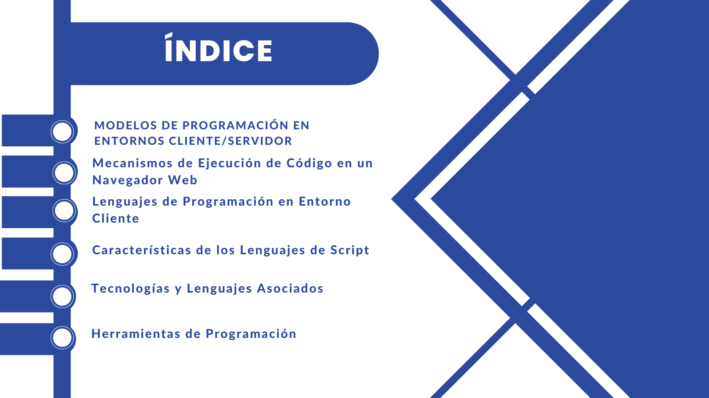

---

theme: gaia
_class: lead
paginate: true
backgroundColor: #fff

---


---



---


---

## Parte 1 - Modelos de Programación en Entornos Cliente/Servidor

Referencia principal: [Link](https://kinsta.com/es/blog/arquitectura-aplicaciones-web/#:~:text=En%20palabras%20sencillas%2C%20la%20arquitectura,el%20cliente%20y%20el%20servidor.)

### Arquitectura de una sola página (SPA)

- Todo se basa en una página.
- Automatización y fluidez.
- Ejemplos: GitHub, Gmail, Google Maps.

[Link de ejemplos](https://appmaster.io/es/blog/que-son-las-aplicaciones-de-una-sola-pagina)

### Arquitectura de aplicaciones web progresivas (PWA)

- Similar a SPA pero con capacidades offline.
- Instalables en dispositivos de usuario.
- Ejemplos: Twitter, Flipkart, Trivago, AliExpress.

[Link de ejemplos](https://www.cisin.com/coffee-break/es/technology/top-progressive-web-app-examples-that-enterprises-can-learn.html)

### Arquitectura de renderizado del lado del servidor (SSR)

- Renderizado en el servidor.
- Páginas web estáticas.
- Usado en blogs y sitios de comercio electrónico.

### Arquitectura de generación de sitios estáticos

- Páginas web generadas previamente.
- Almacenadas como archivos HTML, CSS y JS.
- Tiempos de carga reducidos.

---

## Parte 2 - Mecanismos de Ejecución de Código en un Navegador Web

### Compatibilidad con Navegadores Web

Referencia: [Link](https://www.edgardandrea.com/como-se-ejecuta-javascript-dentro-de-un-pagina-web/)

- Ejecución instantánea en navegadores.
- Código JavaScript en cualquier parte del documento HTML.
- Orden de ejecución y eventos.

### Evaluación de las diferencias de compatibilidad entre navegadores

- Compatibilidad actual alta.
- Ejemplos de comportamiento en diferentes navegadores.

---

## Parte 3 - Lenguajes de Programación en Entorno Cliente

### JavaScript

Referencia: [Link](https://developer.mozilla.org/es/docs/Learn/JavaScript/First_steps/What_is_JavaScript)

- Lenguaje de programación con secuencias de comandos.
- Velocidad, simplicidad y compatibilidad.
- Ampliamente utilizado.

### TypeScript

- Lenguaje de programación con secuencias de comandos.
- Mayor seguridad y mantenibilidad.
- Ideal para proyectos largos.

### VbScript

- Lenguaje de programación en Internet Explorer.
- Perdió relevancia frente a JavaScript.

### Applet Java

- Programas que se descargan en el navegador.
- Compatibilidad, multiplataforma, caché.

---

## Parte 4 - Características de los Lenguajes de Script

- Ventajas: Ejecución instantánea, simplicidad.
- Desventajas: Menos seguridad, dependencia de otros lenguajes.

---

## Parte 5 - Tecnologías y Lenguajes Asociados

##### Exploración de tecnologías como CSS y HTML5

#### HTML5

Referencia: [Link](https://es.wikipedia.org/wiki/HTML5)

- Lenguaje de marcado para páginas web.
- Mejoras respecto a versiones anteriores.
- Ejemplo de etiqueta: 
```html
<p> hola </p>
```

#### CSS

Referencia: [Link](https://es.wikipedia.org/wiki/CSS)

- Lenguaje de diseño para HTML.
- Estilos, diseño y separación de contenido.
- Ejemplos de código CSS.

##### Creación de una pequeña aplicación web

```html
<!DOCTYPE html>
<html lang="es">
<head>
  <meta charset="UTF-8">
  <title>Parte 5</title>
  <script>
    function funcionJS() {
      alert('Buen trabajo');
    }
  </script>
</head>
<body>
  <h1>Parte 5</h1>
  <button onclick="funcionJS()">Click aquí</button>
</body>
</html>

```
---

## Parte 6 - Herramientas de Programación

#### Visual Studio Code

- Editor de código ampliamente utilizado.
- Gratuito y de código abierto.
- Extensible con plugins para varios lenguajes.
- Recomendaciones y mejoras en el código.

[Link](https://solucionescdi.com/conoce-las-ventajas-y-desventajas-de-descargar-visual-studio-code/)


#### GitHub

- Plataforma de alojamiento de código.
- Repositorios públicos y privados.
- Control de versiones colaborativo.
- Utilizado para proyectos individuales y colaborativos.

[Link](https://es.quora.com/Qu%C3%A9-ventajas-y-desventajas-tiene-Git-en-el-control-de-versiones)


#### WordPress

- Sistema de gestión de contenido para crear sitios web.
- Ampliamente utilizado por principiantes y expertos.
- Fácil instalación y personalización.
- Soporte para plugins y temas.

[Link](https://www.hostinger.es/tutoriales/ventajas-wordpress?ppc_campaign=google_search_generic_hosting_all&bidkw=defaultkeyword&lo=1005444&gclid=Cj0KCQjw9rSoBhCiARIsAFOipllOUh_nN19o6duzRgjmLr5dx8adAZLOc50a2wD3EomNOItZ_jjhGFMaAts-EALw_wcB#%C2%BFQue_es_WordPress)


#### Chrome DevTools

- Conjunto de herramientas de desarrollo en Google Chrome.
- Permite inspeccionar y depurar el HTML y CSS de las páginas web.
- Ideal para detectar errores y mejorar el rendimiento.
- Ofrece acceso a la consola para ejecutar JavaScript.

[Link](https://support.google.com/adsense/answer/10858959?hl=es)


## Angular JS

- Framework de JavaScript para la creación de aplicaciones web.
- Enlace bidireccional de datos.
- Estructura de datos para un código más limpio.
- Ideal para proyectos grandes y aplicaciones web.

[Link](https://www.hostinger.es/tutoriales/que-es-angular)

---